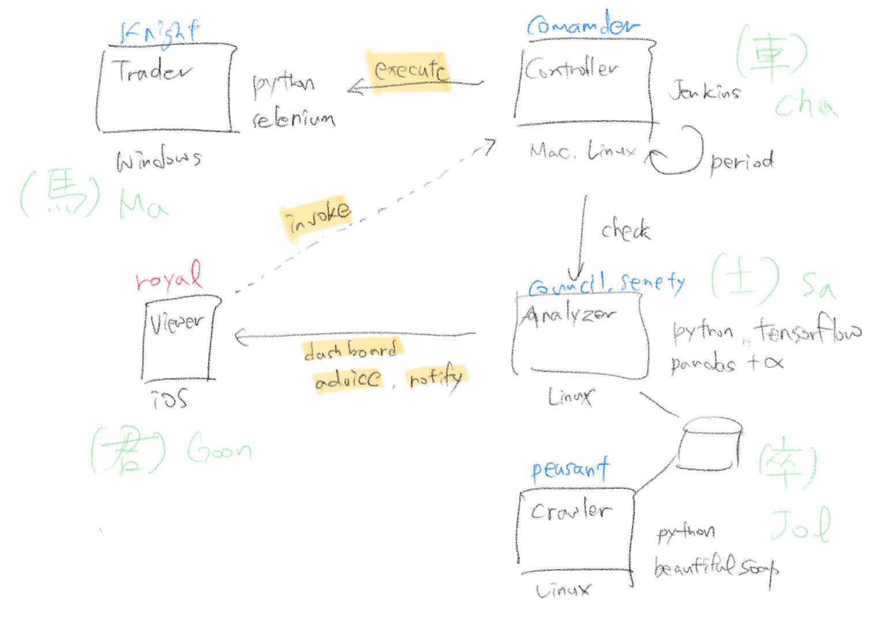

# 알고리즘 트레이딩

 

- [파이썬으로 배우는 알고리즘 트레이딩 (개정판-2쇄) - WikiDocs](https://wikidocs.net/book/110)
- [혼자서 만드는 가상화폐 자동거래 시스템 - WikiDocs](https://wikidocs.net/book/1436)
- [퀀티랩 블로그 - 파이썬을 이용한 자동 주식투자 시스템 개발 튜토리얼 - 키움증권편 (quantylab.com)](http://blog.quantylab.com/systrading.html)
- [시스템트레이딩 시작 시 참조할만한 사이트들 (tistory.com)](https://iamaman.tistory.com/2124)

 

## **알고리즘**

1. 거래량 순위 랭커
    1. 회귀 그래프 기반, 회귀 평균 주기 계산
    2. 거래량 급증 건에 대한 매수 요청
    3. 회귀 주기 하락일 예상 또는 급감의 경우 매도
2. 외국인 매수
    1. 거래량을 외국인 매수세로 판단
    2. 특정 주기(단기) 매도 예정일을 파악하여 투매

 

## **집계 지표**

- 최근 몇 년간 EPS 증가율
- 적정주가 = EPS \* PER (오차범위 큰 것)
- 동종업종 PER 오차범위

 

## 아키텍처

 

## **인프라**

|     |     |
| --- | --- |
| 이름  | 역할  |
| royal | viewer |
| council | analyzer |
| knight | trade |
| commander | controller |
| peasant | crawler |

 

## TF (Ted’s Fortune) Project

### 그냥 생각난 리듬

 

## 용어사전

|     |     |     |
| --- | --- | --- |
| 약어  | 단어  | 의미  |
| EPS | Earnings Per Share  | 주당순이익  |
| PEG | Price Earning to Growth Ratio  | PER / 주당이익증가율  |
| PER | Price Per Ratio  | 주가수익비율  |

 